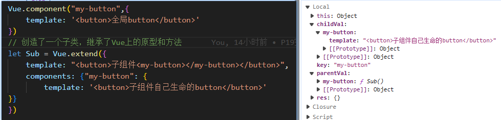
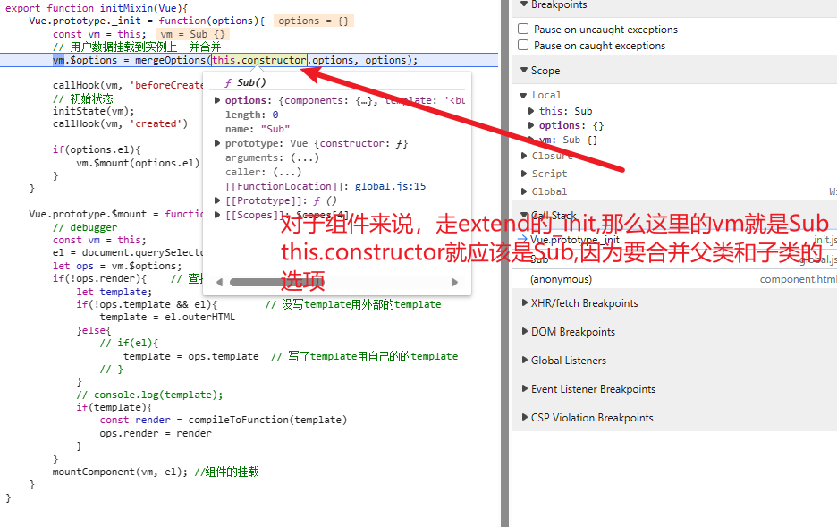
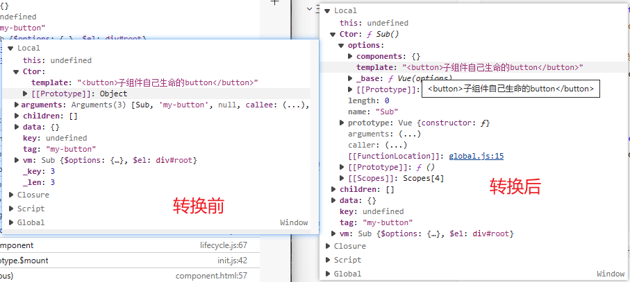
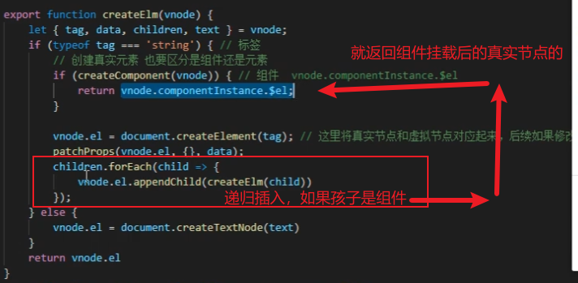

[TOC]

## B站vue2.6源码学习笔记

```
【【vue+vuex+VueRouter源码】从零手写自己的vue】 https://www.bilibili.com/video/BV1JW4y1j7yE/?share_source=copy_web&vd_source=b13bf39ff616b673337790b360357231
```


### **数据代理&数据劫持**

**Vue.prototype._init**将用户options赋值给`vm.$options`，这里的vm是vue实例，

接着将该实例vm交给**initState**(vm)进行处理，initState里判断`vm.$options.data`是否存在，有用户数据存在，则将vm交给initData处理

**initData**(vm)中，会根据用户数据是函数式还是对象式，Vue官方推荐的data表形式是函数式，将vm.$options.data赋值给vm._data,然后将data交给observe(data)进行数据劫持,所以:

```
用户的data === vm.$options.data === vm._data
```

**observe**(data)中首先会判断数据类型，因为只对对象进行数据劫持，判断为对象，则

`return new Observe(data)`

**Observe**(data)`[注: Observe是个类]`中有walk方法，其实就是通过defineProperties重新定义属性，性能不好，

```js
walk(data){
        // 重新定义属性  性能不太行
        Object.keys(data).forEach(key => defineReactive(data,key,data[key]))
    }
   
export function defineReactive(target, key, value) {
    observe(value);
    Object.defineProperties(target, {
        [key]: {
            get() {
                console.log("用户取值了");
                return value;
            },
            set(newValue) {
                console.log("用户更改值了");
                if (value === newValue) return;
                value = newValue;
            }
        }
    });
}   
```

之所以可以通过`vm.属性名`的方式直接访问属性是因为，做了一层代理`(不做的话要通过vm._data.属性名来访问)`，

```js
for(let key in data){
	proxy(vm, "_data", key)
}
// vm._data 用vm 代理 使得读取vm._data.name可以简化为vm.name
function proxy(vm, target, key){
    Object.defineProperties(vm,{
        [key]:
        {
            get(){
                return vm[target][key]
            },
            set(newvalue){                
                if(vm[target][key] === newvalue) return
                vm[target][key] = newvalue
            }
        }
    })
}
```

但是要考虑到data中有数组的情况，Vue中，除了那七个方法之外，不对数组的基本数据类型做监测，现在要实现那七个方法的新增数据的数据劫持，就要重写那七个方法，现在在类Observe的constructor中：

```js
Object.defineProperties(data,{
    ['__ob__']: 
    {
        value: this,
        enumerable: false
    }
})
```

在给data定义一个属性，目的是加上walk observeArray等方法，但是要设置为不可枚举，否则陷入死循环，接下来判断data是否为数组，是就执行:

```js
data.__proto__ = newArrayproto
// 这里我们要重新重写数组的7个方法，但同时保留其他的方法
this.observeArray(data)
//observeArray是遍历数元素，对每个元素observe(item)，目的是将对象全部劫持
```

那么怎么重写数组的七个方法, 这里用到了切片编程:

```js
let oldArrayproto = Array.prototype;

export let newArrayproto = Object.create(oldArrayproto);

let methods = [
    "shift",
    "unshift",
    "pop",
    "push",
    "reverse",
    "sort",
    "splice"
]// concat slice不会改变原数组

methods.forEach((method) => {
    newArrayproto[method] = function(...args){  // 重写数组的方法
        const result = oldArrayproto[method].call(this,...args);   // 内部调用原来的方法，函数劫持 切片编程
        console.log(method);

        // 对对新增的数据再次观测
        let inserted;
        let ob = this.__ob__;  //外部data调用方法，所以this就指向data
        switch(method){
            case 'push':
            case "unshift":     //vm.arr.unshift({a: 100})
                inserted = args;
                break;
            case "splice":      //vm.arr.splice(0, 1, 55,56,57)
                inserted = args.slice(2);
                break;
        }
        console.log(inserted);
        if(inserted){
            ob.observeArray(inserted)
        }
        return result;
    }
})
```

其实很简单，首先创建一个新的原型对象newArrayproto，他和 Array.prototype完全一样，然后重写newArrayproto上的七个方法，内部还是调用了 Array.prototype的那七个方法，只不过将新增的数据，也就是

inserted通过`this.__ob__`上的方法在进行数据劫持，result为方法结果，不处理。


### 模板编译

在Vue.prototype._init中，判断用户的el配置是否存在，有就将el交给vm.$mount(options.el)处理

Vue.prototype.$mount首先查找有无render,没有就:没写template用外部的template,或者写了template用自己的的template，接下来将模板交给compileToFunction

compileToFunction中首先执行parseHTML(html)，parseHTML通过正则表达式和栈的数据结构将html代码转为ast语法树，接着将ast通过codegen(ast)转为

```js
_c('div',{id:"app",key:"app",style:{"color":"red","background-color":"yellow"}},_c('div',{style:{"color":"red"},key:"div"},_v(_s(arr[3].JNTM)+"Terraria"+_s(arr[1])+"Terraria")),_c('span',{key:"span"},_v(_s(tool['铁皮药剂']))))
```

然后将生成的代码封装成函数返回

```js
code = `with(this){return ${code}}`;   //with作用是使代码可以访问传进来的this的属性
let render = new Function(code);    //根据代码生成render函数
```

再将compileToFunction返回的render函数赋值给vm.$options.render

### 执行render函数

完成render函数后，将执行mountComponent(vm, el)挂载组件，这里的el是个真实的dom元素，mountComponent中中，先将el赋值给vm.$el, 然后执行

```js
vm._updata(vm._render());   //虚拟节点扩展为真实节点

//其中 
//vm._render();   //vm.$options.render() 虚拟节点
```

在执行之前，先向Vue的原型上增加几个方法，在更目录index.js中initLifeCycle(Vue);增加

```
_updata，_c, _s, _v, _render
```

_render方法  `也用到了createElementVNode createTextVNode来处理不同的_s _v _c函数 不细讲了`:

```js
    Vue.prototype._render = function(){        
        const vm = this;
        // 让with中的this 指向 vm
        // 当渲染的时候会去实例上取值，我们就可以将属性和视图绑定在一起
        return vm.$options.render.call(vm)    // 通过ast语法转义后的render方法
    }
```

返回的的是虚拟节点，在虚拟节点里，这里实际上会直接去vm上取值，也就是将{{arr[1]}}更换为了具体的用户数据，拿到虚拟节点后，执行_updata方法，更换真实节点，

_updata中，将树形结构的虚拟节点通过递归，创建真实的dom节点，并将属性添加到相应的节点上，接着判断老dom是不是真实元素，这里主要是区分初渲染流程，是的话直接将新的插入，老的删除，否则进行diff算法对比

好了，至此，只要每次数据更新调用`vm._updata(vm._render());`即可更新模板，但是如何实现自动更新，发现通过数据的get 和 set可以完善这套逻辑

现在将`vm._updata(vm._render())`封装到一个函数**updataComponent**中，在创建一个类watcher，一个watcher对应一个组件, 将vm, updataComponent传给watcher

```js
const watcher = new Watcher(vm, updataComponent, true) //true表示是否为渲染函数
```

这时，要进行的工作就是依赖收集，我们要确定一个组件中，使用了几个属性

但是，相对的，一个属性也要确定被几个组件使用了，同时也要注意收集依赖时去重

这里每一个属性都对应了一个类Dep，区分不同的属性使用Dep里的id, watcher同理

同时要做的一件事是，只更新需要更新的组件，也就是更新时，数据的Dep会通知对应的watcher执行重新渲染

因此，使用defineProperties初始化数据时，执行`let dep = new Dep();`,并且在get时：

```js
if(Dep.target){
    dep.depend();//让这个属性收集器记住当前的watch
}
```

set时重新render:dep.notify(), notify方法会将当前Dep上收集的所有watcher触发更新**updata()**函数，这个在处理异步更新时会说到

```js
notify(){
    this.subs.forEach(watcher=>watcher.updata())
}
```

watcher中的`Dep.target = this： `

```
//GPT
	在 Vue 的响应式系统中，每个数据属性都有一个对应的 Dep 对象，而 Dep 对象管理着这个数据属性的依赖项（即依赖该数据属性的 Watcher 实例）。

当一个 Watcher 实例初始化时，它会在内部创建一个依赖项列表，用来存储它所依赖的数据属性的 Dep 对象。在 get 方法中，Watcher 实例会访问数据属性，这会触发数据属性的 get 操作，然后 Dep 对象会将当前的 Watcher 实例添加到自己的依赖项列表中，建立依赖关系。

这样，每个 Watcher 实例都会与它所依赖的数据属性的 Dep 对象建立联系。当数据属性发生变化时，Dep 对象会通知它的依赖项列表中的 Watcher 实例执行更新操作，确保只有相关的 Watcher 会被触发更新，而不会浪费不必要的计算和渲染。
```

watcher中有了`Dep.target = this;`就可以在watcher和Dep中建立双向关系, 

dep.depend()中可以访问到当前的watcher实例Dep.target并调用当前watcher上的addDep方法;

```js
depend(){
    // 不希望放重复的watcher 而且刚才只是一个单向的关系  dep => Watcher
    // this.subs.push(Dep.target);
    Dep.target.addDep(this) //让watcher记住dep  双向
    // watcher和Dep是一个多对多的关系(一个属性可以再多个组件中使用dep -> 多个watcher)
    // 一个组件中由多个属性组成(一个watcher对应多个dep)
}
```

addDep会将该Dep添加到当前的实例watcher上，同时watcher上的addDep(dep)又触发了Dep实例上的addSub方法：

```js
addDep(dep){    //一个事件对应着多个属性 重复的属性也不用记录
    let id = dep.id;
    if(!this.depsId.has(id)){
        this.deps.push(dep);
        this.depsId.add(id);
        dep.addSub(this);   //watcher已经记住了dep,此时让dep也记住watcher
    }
}
```

Dep上的addSub方法又将实例watcher添加到当前的Dep上:

```js
addSub(watcher){
	this.subs.push(watcher)
}
```

建立了依赖关系后，现在发现有个浪费性能的问题，对同一属性的更改最好是只在最后一次触发属性，有点类似防抖，而目前的情况是无论修改同一属性多少次，我们将触发更新相同的次数，解决的手段是将更新事件放到队列里

所以现在将updata()函数写为:

```js
updata(){
    // this.get()  //重新更新 浪费性能的写法
    queueWatcher(this)  //把当前watcher存起来  放到一个队列里
};
```

### 异步刷新

目前维护了一个队列queue, 一个用于防抖目的的对象has，queueWatcher()函数以的ID为辨识，对同一id，has对象只会将对应的watcher在第一次时放进queue,，然后将has[id] = true,将watcher放入queue的条件是(!has[id])，只有当下次watcher的id不同时，才会继续向queue里放watcher, 刷新就执行**nextTick**函数，这个过程为了保证异步刷新，采取了优雅降级的策略，稍微有些复杂

queueWatcher刷新的操作是nextTick(flushSchedulerQueue, 0)

flushSchedulerQueue是清空队列，执行刷新的函数

**nextTick方法不仅用在此处**，作为export的属性，并且被放在了Vue的原型上`Vue.prototype.$nextTick = nextTick`

```js
//主要功能是在下一个事件循环中执行回调函数，它通常用于保证清空刷新任务的异步回调函数按照特定的顺序执行。
export function nextTick(cb){//cb就是flushSchedulerQueue
    //cb是每个待执行的任务
    callbacks.push(cb); //维护nextTick中的callback方法
    if(!waiting){
        timeFunc();
        waiting = true;
    }
}
```

将cb当到队列里，timeFunc()一般来说是用Promise,如果浏览器不支持就一步一步降级下去，以Promise为例：

```js
let timeFunc;       //初始化文件时确定了该函数
if(Promise){
    timeFunc = ()=>{
        Promise.resolve().then(flushCallbacks)
    }
```

flushCallbacks会执行队列里的每个刷新任务，即flushSchedulerQueue，Promise保证了flushSchedulerQueue任务的顺序进行

```
GPT
问: nextTick的功能是不是保证清空刷新任务的顺序执行?
是的，`nextTick` 的主要功能是在下一个事件循环中执行回调函数，它通常用于保证清空刷新任务的异步回调函数按照特定的顺序执行。在 Vue.js 和其他前端框架中，`nextTick` 通常用于以下几个方面：

1. 异步更新 DOM：在前端开发中，有些 DOM 操作可能需要在下一个事件循环中执行，以确保当前的渲染周期完成。例如，当你修改了数据并希望等待 Vue 更新 DOM 后再执行某些操作时，可以将这些操作放在 `nextTick` 的回调函数中。

2. 批量更新：有时候，多个操作需要触发 DOM 更新，但你希望将它们合并成一个批量更新，以提高性能。`nextTick` 可以用于将多个更新操作放在同一个事件循环中执行，而不是每次都触发更新。

3. 异步回调：如果你有一些需要在 DOM 更新后执行的异步回调函数，例如延迟加载图片或执行动画，`nextTick` 也可以派上用场。

`nextTick` 的具体实现方式可以根据环境的不同而有所不同。在现代浏览器环境中，通常会使用 `Promise`、`MutationObserver`、`setImmediate` 或 `setTimeout` 来实现异步回调。其主要目标是确保回调函数在下一个事件循环中执行，从而保证了 DOM 更新的一致性和可预测性。
```

### Mixin

初始化时在Vue上增加一个方法initGlobalAPI，用于将用户的选项和全局的options进行合并

```js
export function initGlobalAPI(Vue) {
  Vue.options = {};
  Vue.mixin = function (mixin) {
    // 我们希望将用户的选项和全局的options进行合并
    this.options = mergeOptions(this.options, mixin);
    return this;
  };
}
```

mergeOptions作为一个方法，采用策略模式来避免if / else, 

```js
// 通过遍历，将选项合并
for (let key in parent) {
    mergeField(key);
  }
```

```js
// 策略模式
// 静态方法
const strats = {};
const LIFECYCLE = ["beforeCreate", "created"];
LIFECYCLE.forEach((hook) => {
  strats[hook] = function (p, c) {
    if (c) {
      if (p) {
        return p.concat(c);
      } else {
        return [c]; //儿子有父亲没有
      }
    } else {
      return p; //如果儿子没有则用父亲即可
    }
  };
});
function mergeField(key) {
    // 策略模式，目的是减少if / else
    if (strats[key]) {
        options[key] = strats[key](parent[key], child[key]);
    } else {
        // 如果不在策略中
        options[key] = child[key] || parent[key]; // 优先采用儿子
    }
}
```

parent的格式类似这样`{created: Array(2), a: 1}`数组里是函数

mergeField在Vue.prototype._init方法执行时，通过`vm.$options = mergeOptions(this.constructor.options, options); `将用户的选项和全局的options进行合并

在lifecycle.js中暴露了方法callHook,

```js
export function callHook(vm, hook){ // 调用钩子函数
    const handlers = vm.$options[hook];
    console.log("handlers: ",handlers);
    if(handlers){
        handlers.forEach((handler)=>{
            handler.call(vm)
        })
    }
}
```

### 数组更新原理

目前还有一个问题，形如：

```js
data() {
                return {
                    name: "随风",
                    work: "盗贼",
                    tool: {
                        "超亮火把": 689,
                        "铁皮药剂": 30
                    },
                    arr: ["FSX", "TONE", "DEAD", { "JNTM": "XHZ" },[1,2]],
                    a:{a:100}
                }
            },
```

当我们更改arr["JNTM"]时是可以监控的，但是当我们直接更改`arr = 500`是无法监控到的，原因是arr是没有自己的dep的，所以现在也要同样收集数组的依赖，在**Observe**里加上**this.dep = new Dep();**

给所有对象也加上dep，接下来，在重新定义data里的属性时，收集数组的依赖**childDep.dep.depend();**但是不止于此，如果数组里面的子元素还有数组，这种写法是无法嵌套收集依赖的，所以判断value是数组后，使用dependArray嵌套收集依赖:

```js
function dependArray(value){
    for(let i = 0;i<value.length; i++){
        let current = value[i];
        current.__ob__ && current.__ob__.dep.depend();
        if(Array.isArray(current)){
            dependArray(current)
        }
    }
}
```

至此，已经完成数组以及数组嵌套依赖的收集

### 计算属性实现

用户配置的计算属性位于`opts.computed`，如果其存在，则将vm传入**initComputed**,初始化计算属性，

在initComputed中

```js
let computed = vm.$options.computed
// 将计算属性的getter保存到vm上,使在vm上可以访问到计算属性的watcher,方便访问
const watchers = vm._createComputedGetter = {} 
```

然后遍历**computed**，对于每个计算属性，都新建一个watcher与之对应，这里传入

```js
watchers[key] = new Watcher(vm, fn, {lazy:true})
```

`tips` ： **{lazy:true}是不希望上来就执行fn 像一般的渲染watcher会直接执行get(),也就是渲染函数**

 **将属性和watcher对应起来**

所以watcher里调用get方法触发渲染函数的地方修改为**this.lazy ? undefined : this.get()  //意味着这个函数发生取值操作**，同时**dirty**是在访问计算属性时，确保只有第一次走初始化逻辑，避免重复操作，因此第一次取值后就更改为false,至此，只是初始化了计算属性的watcher，然后要做的是定义计算属性的get,set,这里只有get需要注意一下，也就是**createComputedGetter**:

```js
function defineComputed(target, key, userDef){
    const setter = userDef.set || (() => {})
    Object.defineProperty(target,key, {
            get:createComputedGetter(key),
            set:setter
    })
}
```

createComputedGetter接收一个key,即具体计算属性的键值，返回一个函数，

**特别注意 ： **该函数初始化时并没有执行，只有渲染页面触发计算属性的get才会执行，

```js
function createComputedGetter(key){
    // 监测是否要执行这个getter
    return function(){
        // 获取到对应的watcher
        const watcher = this._createComputedGetter[key]
        if(watcher.dirty){
            // 求值后dirty为true, 下次就不求了
            watcher.evaluate()
        }
        if(Dep.target){     //渲染watcher                       
            watcher.depend();   //计算属性出栈后，应该让计算属性watcher里面的watcher
            // 月收集上一层的watcher
        }
        return watcher.value
    }
}
```

页面渲染到计算属性时，触发其get时，`const watcher = this._createComputedGetter[key]`会直接定位到该计算属性对应的watcher,因为是第一次渲染(在之前初始化时，因为lazy为true,所以并没有触发渲染函数，也并没有修改lazy的值)，执行:

```js
if(watcher.dirty){
    // 求值后dirty为true, 下次就不求了
    watcher.evaluate()
}
//这个watcher里的getter是: 
	this.getter = exprOrFn;//getter意味着这个函数可以发生取值操作
```

本章还做了一件事，之前dep.js新建了方法pushTarget，popTarget，

```js
let stack = []
export function pushTarget(watcher){
    stack.push(watcher);
    Dep.target = watcher
}
export function popTarget(){
    stack.pop();
    Dep.target = stack[stack.length - 1]
```

**`Dep.target`始终为栈结构的末尾元素，这样的结构可以层层收集watcher**

用于替换get中的`Dep.target = this;`和`Dep.target = null;`现在watcher里的get方法修改为

```js
get(){
    // this:更新函数所在的那个watcher  类中的this都是实例 这里的this=> Watcher
    // Dep.target = this;  //静态属性就是只有一份  实现计算属性时替换为pushTarget(this)
    pushTarget(this)
    let value = this.getter.call(this.vm);//会去vm上取值   
    // Dep.target = null;   //实现计算属性时替换为popTarget()
    popTarget()
    return value
}
```

getter是Watcher传入的fn,对于渲染watcher来说就是渲染函数，对于计算watcher来说就是配置的get，这里实践中发现this.getter()会丢失this,所以通过call将vm绑定给他，这里的vm是新建watcher是传入的vm;同时将get,也就是getter，亦或说fn的执行结果返回并赋值给value,

watcher.evaluate()具体做的就是执行计算属性的get,得到value,并将dirty修改为false

至此，页面上的计算属性可以显示经过计算后的值，也就是get正常工作，**但是set失效**，形如下面的代码，定时器触发时是不会刷新页面的:

```js
//HTML
{{funllName}}
//vm.options
const vm = new Vue({
            data() {
                return {
                    name: "随风",
                    work: "盗贼",
                    tool: {
                        "超亮火把": 689,
                        "铁皮药剂": 30
                    },
                    arr: ["FSX", "TONE", "DEAD", { "JNTM": "XHZ" },[1,2]],
                    a:{a:100}
                }
            },
            computed:{
                funllName:{
                    get(){
                        console.log("run");
                        return this.name + this.arr[1]
                    },
                    set(newValue){
                        console.log(newValue);
                        // return newValue
                    }
                }
            }
        })
//js
setTimeout(()=>{
    console.log("111");
    vm.name = 123
},1000)
```

其实在控制台打印vm.funllName是可以看到已经更改为了`'123TONE'`,问题就出在没有相应的刷新逻辑

为什么，计算属性和用户data的重新定义不在一套逻辑里，计算属性是由`defineComputed`通过`defineProperty`定义的，但是因为计算属性收集的依赖只有计算watcher,

`tips`:	**执行`watcher.evaluate()`会使计算watcher进栈出栈，出栈后的末尾元素即为上层watcher,这里的就是渲染watcher**,也就是说此时的`Dep.target`是渲染**watcher**，让此时的计算watcher去收集渲染watcher即可，其实说法有些不准确，准确的说法是: **计算属性不会收集依赖，只会让自己的属性去收集依赖**

```js
//将渲染watcher加入
if(Dep.target){     //渲染watcher                       
    watcher.depend();    //计算属性出栈后，应该让计算属性watcher里面的属性也去收集上层watcher
    // 收集上一层的watcher
}
```

watcher里的depend()会使计算属性也收集渲染watcher

```js
depend(){
    let i = this.deps.length;
    while(i--){
        // this.deps[i]是Dep
        this.deps[i].depend()   //让计算属性watcher也收集渲染watcher
    }
}
```

计算属性不会收集依赖，只会让自己的属性去收集依赖

`个人理解`	：watcher.depend(); 的watcher是计算watcher,其中的depend()方法的

` while(i--){this.deps[i].depend()}`的目的是让计算属性watcher也收集渲染watcher，这里的deps[i]是Dep,代表的计算属性watcher所依赖的属性，Dep调用depend()方法，执行`Dep.target.addDep(this)`,这里的Dep.target应该是渲染watcher,且是计算属性watcher外层的渲染watcher, this是Dep,

`疑问`:   既然this.deps[i]是Dep，那么就代表了一个属性，this.deps[i].depend()是不是建立计算watcher和渲染watcher的联系

Dep里的let stack = []，存放的是不是当前属性所依赖的watcher


### watch的实现

watch的实现比较简单，和computed的实现一样，底层其实都是基于**Watcher**

首先watch有三种写法

```js
watch:{
    // 写法1: 直接写一个函数
    worker(newValue, oldValue){
        console.log("写法1-newValue: ",newValue);
        console.log("写法1-oldValue: ",oldValue);
    }
    // 'worker':(newValue, oldValue)=>{
    //     console.log("写法1-newValue: ",newValue);
    //     console.log("写法1-oldValue: ",oldValue);
    // }
    // 写法2: 数组
    // worker: [                    
    //     (newValue, oldValue) => {
    //         console.log("newValue: ",newValue);
    //     },
    //     (newValue, oldValue) => {
    //         console.log("newValue: ",newValue);
    //     }
    // ]
}

// watch写法3: $watch
// 底层其实调用的就是$watch的方法，即使方法1或者方法2，最终都是调用$watch
vm.$watch(
    () => vm.worker,
    // function exprOrFn(){return vm.worker},
    // 'worker',    // 或者写成这样            
    function cb(newValue, oldValue){
        console.log("$watch-newValue: ",newValue);
        console.log("$watch-oldValue: ",oldValue);
    })
```

虽然底层最终都是用$watch实现的，但是要写判断逻辑来对应上

**initState**中，在完成**data**和**computed**的初始化后，再判断用户是否配置了watch，初始化watch，逻辑比较简单，判断是数组写法，还是字符串，最终都是用$watch实现

```js
function initWatch(vm){
    let watch = vm.$options.watch
    for(let key in watch){
        const handler = watch[key]; //字符串 数组 函数
        if(Array.isArray(handler)){
            for(let i=0; i< handler.length; i++){
                createWatcher(vm, key, handler[i])
            }
        }else{
            createWatcher(vm, key, handler)
        }
    }
}
function createWatcher(vm, key, handler){
    // 字符串 函数
    if(typeof handler === 'string'){//考虑methods里的方法
        handler = vm[handler];
    }
    return vm.$watch(key, handler)
}
```

因此，需要在`Vue.prototype`上新增`$watch`方法，

```js
Vue.prototype.$watch = function(exprOrFn, cb, options = {}){
    new Watcher(this, exprOrFn, {user: true}, cb)	//user: true表示是用户自己的watcher
}
```

exprOrFn就是key,也就是监视的属性，是一个字符串，所以要做个判断以区别渲染watcher的渲染函数，

```js
if(typeof exprOrFn === 'string'){
    this.getter = function(){
        return vm[exprOrFn]
    }
}else{
    this.getter = exprOrFn;//getter意味着这个函数可以发生取值操作
}
```

字符串则`this.getter`返回值会直接去取vm上对应的属性，否则exprOrFn就是个渲染函数，直接将`exprOrFn`赋给`this.getter`

更新的`run方法也要重写`

```js
//旧run方法
run(){
	this.get()
}
//新run
run(){
    let oldValue = this.value;
    let newValue = this.get();
    if(this.user){
        this.cb.call(this.vm, newValue, oldValue)
    }
}
```


### diff算法

patch(oldVNode, vnode)，是用来更新dom的，初渲染流程用不到diff算法，判断一下oldVNode是不是真实dom,如果是，就代表是初渲染流程，就执行

```js
if(isRealELement){
        const elm = oldVNode;
        const parentElm = elm.parentNode;
        // console.log(parentElm, vnode);
        let newElm = createElm(vnode);
        parentElm.insertBefore(newElm, elm.nextSibling);
        parentElm.removeChild(elm);

        return newElm
```

这代表了直接把原真实dom删除，由以真实dom生成的ast语法树经过模板编译后生成的真实dom替代，


**否则进行diff算法对比虚拟dom：**
先`isSameVnode`判断新旧是否一样，比较的是`vnode1.tag === vnode2.tag && vnode1.key === vnode2.key`不是一个虚拟dom则直接替换，否则说明外层容器是一个虚拟节点, 然后对比文本，先复用老的文本，如果新旧文本不一，则用新的，然后通过`patchProps`处理样式，新有旧无，新无旧有等情况，接下来就是对比儿子节点，当双方儿子数都不为0`updateChildren`更新孩子，或者新的大于0且旧的为0直接加入，或者旧的大于0且新的为0直接删除，之后`updateChildren`对比过程中使用多种策略进行提速，

头头对比 尾尾对比 交叉对比  乱序对比

添加方法获得每个孩子的唯一key:  这里用了`while`循环处理

```js
//处理因为索引表导致当前索引对应的旧节点出现undefined，需要跳过的情况
function makeIndexByKey(children){
    let map = {}
    children.forEach((child, index)=>{
        map[child.key] = index
    })
    return map
}
let map = makeIndexByKey(oldChildren)
```

除了乱序对比，其他不赘述了，乱序对比：

```js
// 乱序比对
let moveIndex = map[newStartVnode.key];
//判断老节点的孩子中是否有key为newStartVnode.key的child
if(moveIndex !== undefined){
    let moveVnode = oldChildren[moveIndex];//有就找到对应的虚拟儿子节点
    //直接将该孩子插入老节点的第一位，因为取的是新虚拟节点拍在第一位的节点
    el.insertBefore(moveVnode.el, oldStartVnode.el);
    //将该孩子原位置设为undefined，表示这个节点已经移走了，key正是为了这种情况创立的
    oldChildren[moveIndex] = undefined;
    patchVnode(moveVnode, newStartVnode);//比较属性和子节点
}else{
    //表示老节点的孩子中没有key为newStartVnode.key的child，那么直接创建一个并且插入到旧虚拟节点的第一位
    el.insertBefore(createElm(newStartVnode), oldStartVnode.el);
}
newStartVnode = newChildren[++newStartIndex]
```

 经过之上的while循环之后，无非就剩下了两种情况：

1> 要么新节点还有多的，

2> 或者旧结点有多余的

根目录index.js测试代码:

```js
let render1 = compileToFunction(`<ul a="1" key="a" style="color:#0000ff;background-color: #ff0000">    
<li key="a">1</li>
<li key="b">2</li>
<li key="c">3</li>  
<li key="d">4</li>    
</ul>`);
let vm1 = new Vue({data:{name:'第一次'}});
let preVnode = render1.call(vm1)

let el = createElm(preVnode);
document.body.appendChild(el)

// let render2 = compileToFunction('<span>{{name}}</span>');
let render2 = compileToFunction(`<ul a="1" key="a" style="color:#0000ff;background-color: #00ff00">
<li key="b">2</li>
<li key="m">5</li>
<li key="a">1</li>
<li key="p">6</li>
<li key="c">3</li>  
<li key="q">7</li>        
</ul>`);
let vm2 = new Vue({data:{name:'第二次'}});
let nextVnode = render2.call(vm2)
// console.log(nextVnode);

setTimeout(()=>{    
    patch(preVnode, nextVnode)
}, 1000)

```


在initLifeCycle里的_updata:

```js
const vm = this;
const el = vm.$el;
let elm = patch(el, vnode);
vm.$el = elm
```

这些逻辑被封装到了updataComponent，在实例化watcher是就会调用，也就是说页面加载时即执行


`tips`:	P17代码敲完后，有个地方似乎有问题,initLifeCycle里的_updata里：
	`let elm = patch(el, vnode);`中，patch始终返回的是真实dom,也就是`const el = vm.$el;`也是个真实dom, 那么会导致始终是走的初渲染流程，因为`patch(oldVNode, vnode)`的oldVNode始终是真实dom

因此修改为：

```js
Vue.prototype._updata = function(vnode){
    const vm = this;
    const el = vm.$el;

    const preVnode = vm._vnode;
    vm._vnode = vnode;//组件第一次的渲染的虚拟节点保存到_vnode上

    if(preVnode){//之前渲染过了
        vm.$el = patch(preVnode, vnode)
    }else{
        vm.$el = patch(el, vnode)
    }
}
```


### 组件的虚拟节点

自定义组件的写法：

```js
// 1>
const vm = new Vue({
    data() {
        return {
            name: "随风",
            work: "盗贼",
            worker: "self",
            tool: {
                "超亮火把": 689,
                "铁皮药剂": 30
            },
            arr: ["FSX", "TONE", "DEAD", { "JNTM": "XHZ" },[1,2]],
            a:{a:100}
        }
    },
    components:{ //js原型链 自己没有再向外找
        "my-button": Vue.extend({
            template: '<button>内部</button>'
        })
    }
})
// 2>
Vue.component("my-button",{
    template: '<button>全局button</button>'
})
// or
Vue.component("my-button", Sub)
// 3>
let Sub = Vue.extend({
    template: "<button>子组件<my-button></my-button></button>",
    components: {"my-button": {
        template: '<button>子组件自己生命的button</button>'
    }}
})
new Sub().$mount('#root')
```

其实最终调用的都是`Vue.extend`, `initGlobalAPI`新增方法`Vue.extend`和配置

```js
 Vue.options = {
    _base: Vue
  };
```


```js
  Vue.extend = function(options){
    // 就是实现根据用户的参数，返回一个构造函数而已
    function Sub(options = {}){ //最终使用一个组件，就是new一个实例
      this._init(options);  //就是默认对子类进行初始化操作
    }
    Sub.prototype = Object.create(Vue.prototype); //Sub.prototype._proto_ === Vue.prototype
    Sub.prototype.constructor = Sub;
    // 将用户传递的选项的参数和全局的合并
    Sub.options = mergeOptions(Vue.options, options);  //保存用户传递的选项
    // debugger
    return Sub
  }
```

其实就是返回了一个类，上拥有Vue的方法，以方便后面的组件虚拟节点化，并且在这个过程，合并了全局和用户的选项，主要是处理component,全局组件和自定义组件的优先级是自定义更高，所以`mergeOptions`稍加修改

```js
//添加
strats.components = function(parentVal, childVal){
  const res = Object.create(parentVal);
  
  if(childVal){
    for(let key in childVal){      
      // 返回的是构造的对象 可以拿到富强原型上的属性，并且将儿子的都拷贝到自己身上
      res[key] = childVal[key];
    }
  }

  return res;
}
```

`childVal 和 parentVal`的形式是这样的：



```js
// 这段代码执行完Sub.prototype.constructor就是Vue了，所以要手动纠正
Sub.prototype = Object.create(Vue.prototype); //Sub.prototype._proto_ === Vue.prototype
//添加
Sub.prototype.constructor = Sub;
```

`Sub.prototype.constructor如果变成Vue`会导致



```js
Vue.prototype._init = function(options){
    const vm = this;
    // 用户数据挂载到实例上  并合并
    vm.$options = mergeOptions(this.constructor.options, options); 

    callHook(vm, 'beforeCreate')
    // 初始状态
    initState(vm);
    callHook(vm, 'created')

    if(options.el){
        vm.$mount(options.el)
    }
}
```

没有el,所以不走$mount,后面自己会手动调用

对于全局组件

```js
  Vue.options.components = {}; //全局的指令
  Vue.component = function(id, definition){
    // 如果definition已经是一个函数了，说明用户自己调用了Vue.extend
    definition = typeof definition === 'function' ? definition : Vue.extend(definition);
    Vue.options.components[id] = definition
  }
```

在模板编译也要新增对应的组件的相关配置

通过

```js
const isReservedTag = (tag) => {
    return ['a', 'div', 'p', 'button', 'ul', 'li', 'span'].includes(tag)
}
```

判断当前的标签是否是组件

并在`createElementVNode(vm,tag, data, ...children)`新增

```js
if(isReservedTag(tag)){        
    return vnode(vm,tag,key,data,children)
}else{
    let Ctor = vm.$options.components[tag];
    return createComponentVnode(vm, tag, key, data, children, Ctor)
}
```

`Ctor` ： 其实就是模板

```js
function createComponentVnode(vm, tag, key, data, children, Ctor){    
    // console.log(vm.$options._base); //拿到Vue       
    if(typeof Ctor === 'object'){
        //如果Ctor是个对象就要给转成一个类
        Ctor = vm.$options._base.extend(Ctor);
    } 
    data.hook = {
        init(vnode){
            let instance = vnode.componentInstance = new vnode.componentOptions.Ctor
            instance.$mount();
        }
    }
    return vnode(vm,tag,key,data,children,null, {Ctor})
}
```

`如果Ctor是个对象就要给转成一个类`



`init方法`   `new vnode.componentOptions.Ctor` 先实例化一个Sub再赋值给

`instance` 和 `vnode.componentInstance`并且`instance.$mount();`将组件的虚拟节点转为了真实DOM

```js
data.hook = {
    init(vnode){
        let instance = vnode.componentInstance = new vnode.componentOptions.Ctor
        instance.$mount();
    }
}
```

`$mount`会调用`patch`，但是组件的挂载没有el,也就是$el,这两个是一个东西，也就是`patch(oldVNode, vnode)`没有oldVNode，没有oldVNode就说明是组件的挂载，`patch(oldVNode, vnode)`最开始添加逻辑

```js
if(!oldVNode){ // 这就是组件的挂载        
	return createElm(vnode); // vm.$el  对应的就是组件渲染的结果了
}
```

`createElm(vnode)`稍加修改

```js
if(typeof tag === 'string'){    //标签
    // 创建真实元素，也要区分是组件还是元素
    //《=新增
    if(createComponent(vnode)){ // 组件 vnode.componentInstance.$el
    	return vnode.componentInstance.$el;
    }
    //新增=》
    vnode.el = document.createElement(tag); //这里将真实节点和虚拟节点对应起来，后续如果修改属性
    patchProps(vnode.el, {}, data)
    children.forEach((child) => {
        // console.log(vnode);
        vnode.el.appendChild(createElm(child))  //递归，不断地向vnode.el里添加html元素
    })        
}
```

`createComponent`:

```js
function createComponent(vnode){
    let i = vnode.data;
    if((i = i.hook) && (i = i.init)){
        // debugger
        i(vnode); // 初始化组件 ， 找到init方法
    }
    if(vnode.componentInstance){
        return true; // 说明是组件
    }
}
```

`vnode.componentInstance.$el`  其实就是一个真实节点




